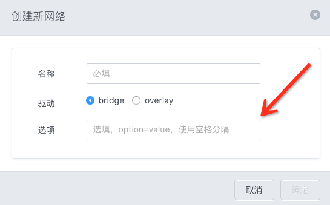

DCE 为用户提供了基于 WEB 的控制台，通过浏览器访问 DCE 主控节点 IP 即可进入控制台。
DCE 控制台具有管理网络的功能，点击 DCE 控制台「网络」即可进入网络管理页面。


## 创建网络

目前，DCE 支持用户通过 DCE 控制台快速创建两种不同驱动方式的网络：

bridge：默认的容器网络驱动，容器通过一对 veth pair 连接到 docker0 网桥上，由系统自动为容器动态分配 IP 和配置路由、防火墙规则等。
overlay：跨主机多子网网络方案，要通过使用 Linux bridge 和 vxlan 隧道实现，底层通过类似 etcd 的 KV 存储系统实现多机的信息同步。


点击「网络」管理子页面的「创建」选项就能够创建新的用户网络，包括 Bridge 网络和 Overlay 虚拟网络。


一般情况下，创建网络要指定网络名称和驱动方式，DCE 控制台创建 bridge 相当于如下命令：
```
docker network create --driver bridge {{网络名称}}
```

## 管理网络
在 DCE 控制台网络管理子页，DCE 为每个网络提供了可选择的管理服务。当用户点击网络列表最右方的下拉按钮，即可根据需要对网络进行各类操作。


操作说明：

| 操作 | 操作说明 |
| ---- | ---- |
| 删除 | 删除当前网络 |
| 使用 CLI 操作 | 弹出通过 CLI 客户端进入容器进行网络管理的命令 |


## 网络创建选项

在创建网络的时候，DCE 为用户提供了添加创建选项的操作：


需要注意的是，如果用户使用 bridge 作为网络的驱动，那么不可填写这栏，因为目前 Docker 内建的 bridge 网络驱动不会接受任何选项。如果用户使用 overlay 作为网络的驱动，创建一个跨主机的虚拟网络，那么可能需要填写不同的选项。

下表为 overlay 支持的选项：

| 选项 | 选项说明 |
| ---- | ------- |
| `--cluster-store=PROVIDER://URL` | 指定 KV 键值库位置 |
| `--cluster-advertise=HOST_IP|HOST_IFACE:PORT` | 主机的 IP 地址或主机的接口 |
| `--cluster-store-opt=KEY-VALUE OPTIONS` | 关于 TLS 证书等的选项 |
