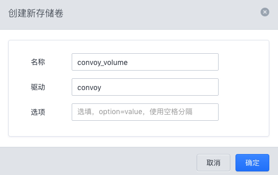
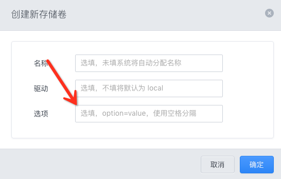

DCE 为用户提供了基于 WEB 的控制台，通过浏览器访问 DCE 主控节点 IP 即可进入控制台。
DCE 控制台具有管理存储卷的功能，点击 DCE 控制台「存储卷」即可进入存储卷管理页面。


## 创建存储卷

在 Docker 容器中产生的数据，如果不通过 `docker commit` 生成新的镜像，使得数据成为镜像的一部分保存下来，那么容器中的数据就会在删除容器后丢失。为了持久化存储和共享容器中的数据，需要创建存储卷。 

点击「存储卷」管理子页面的「创建」选项就能够创建新的存储卷，你可以自由的设置新存储卷的驱动方式。


一般情况下，创建存储卷只要指定存储卷名称即可，存储卷的 driver 会自动使用 local，相当于如下命令：
```
docker volume create --name {{存储卷名称}}
```

如果你需要创建指定 driver 方式的存储卷，你需要先安装存储卷插件。

这里以 Convoy 作为示例。首先你需要通过如下命令安装 Convoy：

```
wget https://github.com/rancher/convoy/releases/download/v0.4.3/convoy.tar.gz
tar xvf convoy.tar.gz
sudo cp convoy/convoy convoy/convoy-pdata_tools /usr/local/bin/
sudo mkdir -p /etc/docker/plugins/
sudo bash -c 'echo "unix:///var/run/convoy/convoy.sock" > /etc/docker/plugins/convoy.spec'
```

安装完成后，你需要手动启动 Convoy daemon。Convoy 支持多种存储卷驱动，这里选择 VFS，并设置路径为 /data ，命令如下：

```
sudo convoy daemon --drivers vfs --driver-opts vfs.path=/data
```

接下来，你并可以通过 DCE 控制台创建使用 Convoy 驱动的存储卷：


使用 Convoy 驱动的存储卷可以在 DCE 控制台的远程卷中查看详细信息：


>>>>> 更多关于 Convoy 的信息，可以参考[Convoy](https://github.com/rancher/convoy)


## 管理存储卷
在 DCE 控制台存储卷管理子页，DCE 为每个存储卷提供了可选择的管理服务。当用户点击存储卷列表最右方的下拉按钮，即可根据需要对存储卷进行各类操作。


操作说明：

| 操作 | 操作说明 |
| ---- | ---- |
| 删除 | 删除当前存储卷 |
| 使用 CLI 操作 | 弹出通过 CLI 客户端进入容器进行存储卷管理的命令 |


## 存储卷创建选项

在创建存储卷的时候，DCE 为用户提供了添加创建选项的操作：


需要注意的是，如果用户使用 local 作为存储卷的驱动，那么不可填写这栏，因为目前 Docker 内建的 local 存储卷驱动不会接受任何选项。
对于 local 之外的其他存储驱动，都用提供了各自独有的选项，使用不同的驱动方式，就必须使用不同的选项，没有统一的标准，故而需要用户查看这些驱动的官方文档，了解它们为用户提供了哪些选项。